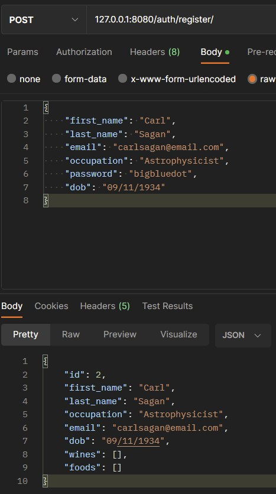
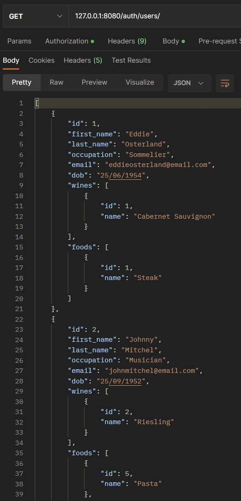
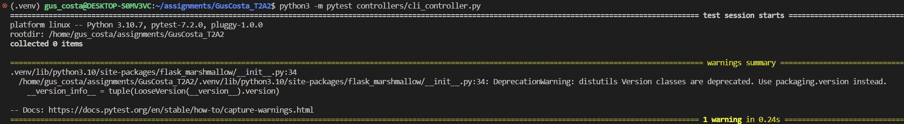

# **GusCosta_T2A2**

[**GusCosta_T2A2 - Github Repository Link**](https://github.com/Guscosta88/GusCosta_T2A2)

# **Table of contents:**

- [**Table of contents**](#table-of-contents)
    - [**R0 - Installation instructions:**](#r0---installation-instructions)

    - [**R1 - Identification of the problem you are trying to solve by building this particular app.**](#r1---identification-of-the-problem-you-are-trying-to-solve-by-building-this-particular-app)

    - [**R2 - Why is it a problem that needs solving?**](#r2---why-is-it-a-problem-that-needs-solving)

    - [**R3 - Why have you chosen this database system. What are the drawbacks compared to others?**](#r3---why-have-you-chosen-this-database-system-what-are-the-drawbacks-compared-to-others)

    - [**R4 - Identify and discuss the key functionalities and benefits of an ORM.**](#r4---identify-and-discuss-the-key-functionalities-and-benefits-of-an-orm)

    - [**R5 - Document all endpoints for your API**](#r5---document-all-endpoints-for-your-api)

    - [**R6 - An ERD for your app**](#r6---an-erd-for-your-app)

    - [**R7 - Detail any third party services that your app will use**](#r7---detail-any-third-party-services-that-your-app-will-use)

    - [**R8 - Describe your projects models in terms of the relationships they have with each other**](#r8---describe-your-projects-models-in-terms-of-the-relationships-they-have-with-each-other)

    - [**R9 - Discuss the database relations to be implemented in your application**](#r9---discuss-the-database-relations-to-be-implemented-in-your-application)

    - [**R10 - Describe the way tasks are allocated and tracked in your project**](#r10---describe-the-way-tasks-are-allocated-and-tracked-in-your-project)

    - [**R11 - Testing**](#r11---testing)

----------------------------------------------------------------

#### **R0 - Installation instructions:**

#### **Open your WSL command line and run the following commands:**

- psql
- create database wine_and_food;

#### **Open another WSL command line and run the following commands:**

- python3 -m venv .venv
- source .venv/bin/activate
- pip install Flask &&
    pip install flask-sqlalchemy &&
    pip install psycopg2-binary &&
    pip install flask-marshmallow &&
    pip install marshmallow-sqlalchemy &&
    pip install flask-bcrypt &&
    pip install flask-jwt-extended &&
    pip install python-dotenv &&
    pip install Flask-Mail
- pip freeze > requirements.txt
- flask db create
- flask db seed
- flask run

- This should allow you to open 127.0.0.1:8080/ on your browser or Postman.


#### **R1 - Identification of the problem you are trying to solve by building this particular app.**

- It takes a name of a type of wine and it returns food options that pair with it.
- It allows the user to acquire knowledge about the different types of wine and the foods that goes with it.
- The user can register, add wine information and food information.
- It allows people to share their knowledge with others.
- There are many types of wines, many people find comfort and pleasure in pairing good wines with good food and finding this perfect balance between tastes and textures can be hard sometimes, when someone comes accross the perfect combination they can access this API and share it with others. It can also be used by professionals such as Chefs and Sommeliers, so wine enthusiasts can see what they shared and be sure they wont be disappointed with the professional approach on something that for some is just a hobbie.

#### **R2 - Why is it a problem that needs solving?**

- Anyone that has an interest in foods and wines can access this API and use it to acquire more knowledge about it, not many options are available for this kind of market.
- It can be used on food apps, restaurant apps, bottleshop apps and other.
- To show that the person accessing the app, can cook food that pairs with it and enjoy the little things in life.
- Professionals can access the app to add information and share actual professional opinion.
- It can connect many people from different levels of knowledge and that share the same passion.
- It can be helpful for someone very experienced to see what people's opinions are related to his or her professional opinion as well as the other way around.
- There could be many combinations of flavours considering the many types of wines, cultures and foods in the world, people from similar cultures can find a combination appealing while others would not have imagined such combinations and be surprised, I think these possibilities are the core reason for this API, to share experiences, human experiences and be amazed by opening up for other people's suggestions of pairing.

#### **R3 - Why have you chosen this database system. What are the drawbacks compared to others?**

- Postgres is an open source database system that supports relations, SQL, available in the most popular Operating Systems and it is scalable, its features include stored procedures, foreign keys, views, triggers and it has been around for years which means that it has a reliable community with extensive support and resources.
    The Postgres Schemas are flexible and can be used to hold all objects facilitating the interactions between items, two items with the same name can be present in the database.
    Postgres is compatible with the most important datatypes which opens up the possibility of creating many different systems.
    For the wine and food pairing project I have decided to use PostgreSQL due to the fact that it works with Python really well and there are many Python packages designed to work with PostgreSQL, which facilitates development.

        Main reasons for using PostgreSQL over other databases:

        Mongo DB vs PostgreSQL: 

        Pro: MongoDB is a noSQL database while PostgreSQL can be both.
        Con: The Fact that MongoDB uses collections instead of tables.

        MySQL vs PostgreSQL: 

        Pro: Performance, Postgresql can perform better even with heavier workloads.
        Con: Administration is easier to set-up.

    In conclusion, every Database system out there can be better suit for one job ratter than another, however, PostgreSQL has passed the test of time, performance and reliability and for this specific app, it integrates well with the technologies chosen and for that reason it is was the best choice.
    Find bellow the whole structure of the database used in this application written in PostgreSQL.
    
    
    

    [Why Postgresql](https://fulcrum.rocks/blog/why-use-postgresql-database#:~:text=Postgres%20allows%20you%20to%20store,lot%20of%20supporters%20and%20critics.)

    [postgresql](https://en.wikipedia.org/wiki/PostgreSQL)

    [mongodb](https://kinsta.com/blog/mongodb-vs-postgresql/#:~:text=A%20key%20feature%20that%20sets,two%20tables%20to%20each%20other.)

----------------------------------------------------------------

#### **R4 - Identify and discuss the key functionalities and benefits of an ORM.**

- Object Relational Mapping (ORM), in object oriented programming (OOP) it is a way of manipulating objects without interfering or even aknowledging its source, it is used to make a bridge between relational databases and programming languages where both can communicate with each other, one of the reasons for using an ORM tool is to make the code dryer, considering that writing a whole SQL query such as the following:

        "SELECT id, name, email, country, phone_number FROM users WHERE id = 20"

    it is way simpler if written in OOP format like this using ORM:

        users.GetById(20)

    Other reasons for using ORM, any interaction with items from the database can be made using the same language, it can inherit tables and objects, better manipulating complex data types, Extensibility, one drawback is that due to its abstract concept it can hide what is happening on the background making it more complex.
    In the wine and food project, which is designed using Python, the ORM tool chosen to be applied is an open source tool called SQLAlchemy, which in this case can be installed with a Pyhton PyPi Package.

    PostgreSQL table users:

    

    Sql Alchemy Structure table users:

    ```py 
    from flask_sqlalchemy import SQLAlchemy
    db = SQLAlchemy()

            class User(db.Model):
                __tablename__ = 'users'

                id = db.Column(db.Integer, primary_key=True, nullable=False)
                first_name = db.Column(db.String, nullable=False)
                last_name = db.Column(db.String, nullable=False)
                occupation = db.Column(db.String)
                email = db.Column(db.String, nullable=False, unique=True)
                password = db.Column(db.String, nullable=False)
                dob =db.Column(db.String, nullable=False)
    ```
    In this example the SQLAlchemy is being imported, and stored in the "db" variable, and each item is structured in columns with its selected data types, primary_key, nullable attributes.

    Json Outcome table users:

    


    [ORM](https://en.wikipedia.org/wiki/Object%E2%80%93relational_mapping)

    [ORM advantages](https://www.tutorialspoint.com/Object-relational-Data-Model)

    [Sql vs ORM example](https://www.freecodecamp.org/news/what-is-an-orm-the-meaning-of-object-relational-mapping-database-tools/)


----------------------------------------------------------------


#### **R5 - Document all endpoints for your API.**

- All information is returned in JSON format.

----------------------------------------------------------------

#### **1. auth/register/**

- Method: Post
- Identifier: None
- Authentication: Password Hashed with the use of Bcrypt
- Token: None
- Description: Adds new user information to the Database.



----------------------------------------------------------------

#### **2. auth/login/**

- Method: Post
- Identifier: Email
- Authentication: email and Password
- Token: Generated with JWT
- Description: Allows the registered user to Login and it generates a JWT Token required to access the other routes.


----------------------------------------------------------------

#### **3. auth/users/**

- Method: Get
- Identifier: None
- Authentication: None
- Token: None
- Description: It displays a list with all users, including which wine and which food the user entered.



----------------------------------------------------------------

#### **4. auth/users/id**

- Method: Get
- Identifier: user_id
- Authentication: None
- Token: None
- Description: It displays information of the user with the selected id, including which wine and which food the user entered.


----------------------------------------------------------------

#### **5. wines/**

- Method: Post
- Identifier: user_id
- Authentication: @jwt_required()
- Token: JWT Access bearer Token Generated when login is successful.
- Description: It allows the user to add a new wine to the database and it returns the new entered wine and user information. It also adds the date created with the use of datetime Python Module.


----------------------------------------------------------------

#### **6. wines/**

- Method: Get
- Identifier: None
- Authentication: None
- Token: None
- Description: It Displays all wines in the database.


----------------------------------------------------------------

#### **7. wines/id**

- Method: Get
- Identifier: wine_id
- Authentication: None
- Token: None
- Description: It Displays id selected wine information.


----------------------------------------------------------------

#### **8. wines/id**

- Method: Delete
- Identifier: wine_id
- Authentication: @jwt_required()
- Token: JWT Access bearer Token Generated when login is successful.
- Description: It Deletes id selected wine information and returns a delete successfully message.


----------------------------------------------------------------

#### **9. wines/id**

- Method: Put / Patch
- Identifier: wine_id
- Authentication: @jwt_required()
- Token: JWT Access bearer Token Generated when login is successful.
- Description: It Updates id selected wine information and returns Updated wine Information.


----------------------------------------------------------------

#### **10. foods/**

- Method: Post
- Identifier: user_id
- Foreign key: wine_id
- Authentication: @jwt_required()
- Token: JWT Access bearer Token Generated when login is successful.
- Description: It allows the user to add a new food to the database and it returns the new entered food, user and wine information. It also adds the date created with the use of datetime Python Module.


----------------------------------------------------------------

#### **11. foods/**

- Method: Get
- Identifier: None
- Authentication: None
- Token: None
- Description: It Displays all foods in the database.


----------------------------------------------------------------

#### **12. foods/id**

- Method: Get
- Identifier: food_id
- Authentication: None
- Token: None
- Description: It Displays id selected food information. It also returns user information and information about the wine that pairs with it.


----------------------------------------------------------------

#### **13. foods/id**

- Method: Delete
- Identifier: food_id
- Authentication: @jwt_required()
- Token: JWT Access bearer Token Generated when login is successful.
- Description: It Deletes id selected food information and returns a delete successfully message.


----------------------------------------------------------------

#### **14. foods/id**

- Method: Put / Patch
- Identifier: food_id
- Authentication: @jwt_required()
- Token: JWT Access bearer Token Generated when login is successful.
- Description: It Updates id selected food information and returns Updated food Information.


----------------------------------------------------------------

#### **14. send/**

- Method: Get
- Identifier: food_id
- Authentication: @jwt_required() and Mailtrap username and password.
- Token: JWT Access bearer Token Generated when login is successful.
- Description: It sends an e-mail with a message and JSON list of food information via Mailtramp third party service.


----------------------------------------------------------------

#### **Error Handling Endpoints and code snippets:**

----------------------------------------------------------------

#### **1. auth/login/**

- Method: Post
- Identifier: None
- Authentication: email and password
- Token: None
- Description: Tried login in without required information.
- Error: 400 Bad Request


----------------------------------------------------------------

#### **2. wines/**

- Method: Post
- Identifier: user_id
- Authentication: @jwt_required()
- Token: JWT Access bearer Token Generated when login is successful.
- Description: Tried adding new wine but had a field typo. Returns an Unknown field message.
- Error: 400 Bad Request


----------------------------------------------------------------

#### **3. wines/**

- Method: Post
- Identifier: user_id
- Authentication: @jwt_required()
- Token: JWT Access bearer Token Generated when login is successful.
- Description: Tried adding new wine without token. returns a missing authorization message.
- Error: 401 Unauthorized


----------------------------------------------------------------

#### **4. auth/login/**

- Method: Post
- Identifier: email
- Authentication: email and password
- Token: None
- Description: Tried login in with wrong password. Returns a invalid email or password message.
- Error: 401 Unauthorized


----------------------------------------------------------------

#### **5. 404**

- Method: Get
- Identifier: None
- Authentication: None
- Token: None
- Description: Tried accessing non existing route. Returns a not found message.
- Error: 404 Not Found


----------------------------------------------------------------

#### **6. auth/register/**

- Method: Post
- Identifier: None
- Authentication: None
- Token: None
- Description: Tried Registering with email already entered in the database. Returns a email already exists message.
- Error: 409 Conflict


----------------------------------------------------------------

#### **7. foods/**

- Method: Post
- Identifier: user_id
- Foreign Key: wine_id
- Authentication: @jwt_required()
- Token: JWT Access bearer Token Generated when login is successful.
- Description: Tried adding new food and entered non existing wine_id foreign key. return a wine_id not present in the table message.
- Error: 500 IntegrityError


----------------------------------------------------------------


#### **R6 - An ERD for your app.**


#### **R7 - Detail any third party services that your app will use.**

- The Third Party Service chosen to be used by this app is called Mailtrap, Mailtrap is widely used by many apps and it has a Feature that allows you to create a fake Simple Mail Transfer Protocol (SMTP) server for testing purposes, which makes it possible to check e-mail sending functionalities as well as notifications without sending anything to real users.
    Upon registering in the Mailtrap website, the user is provided with a username key as well as a password key, Port Number, Server name, Transport Layer Security (TLS) Encryption and Secure Socket Layer (SSL) Secure communication between server and client.
    The Keys are stored in the .env file and being imported securely by os.environ.get().
    See bellow how Mailtrap was implemented.
    Instructions to access the email and test are in the .env file.

#### **The code to add Mailtrap route.**

```py

    # Mailtrap Third party service set-up 
    app.config['MAIL_SERVER']= os.environ.get('MAIL_SERVER')
    # This is where the mail server config is setup and retrieves it from .env
    app.config['MAIL_PORT'] = os.environ.get('MAIL_PORT')
    # This is where the server port config is setup and retrieves it from .env
    app.config['MAIL_USERNAME'] = os.environ.get('MAIL_USERNAME')
    # This is where the user config is setup and retrieves it from .env
    app.config['MAIL_PASSWORD'] = os.environ.get('MAIL_PASSWORD')
    # This is where the user password config is setup and retrieves it from .env
    app.config['MAIL_USE_TLS'] = True
    app.config['MAIL_USE_SSL'] = False
    mail = Mail(app)

    @app.route("/send/")
    def index():
        stmt = db.select(Food).filter_by(id=1)
        food = db.session.scalar(stmt)
        message_body = FoodSchema().dump(food)
        # This Function retrieves the Food JSON by id, with food, wine and user information and it stores in the message_body variable.
        msg = Message('Hello wine and food suggestions!', sender =   'alexandra@mailtrap.io', recipients = ['paul@mailtrap.io'])
        msg.body = f"Look at my suggestion of pairing {message_body}"
        # The message_body variable is then populated together with a message to be sent by email. 
        mail.send(msg)
        return "Message sent!"
        # once the message is sent a "Message sent!" message is returned

    if __name__ == '__main__':
        app.run(debug = True)

```

#### **The message returned by Postman.**


#### **The test email being received in the Maitrap Sandbox Test Inbox.**


#### **R8 - Describe your projects models in terms of the relationships they have with each other.**

- The API wine and foods is represented on the ORM level by the use of an MVC system where its main structure takes place in the Models, the same way the database wine and food has 3 tables, it also has 3 models that represents, in OOP written in Python, those 3 tables as follows.The SQL Alchemy is the ORM that allows queries to be written in Python instead of SQL syntax, in this case, the class uses Sqlalchemy to create a table structure with column names and data types.Marshmallow is an integration tool used alongside SQL alchemy, it converts complex data types from and into Python.As seen below, the foods and the wines models are related to users on a one to many relationship.

- The User Model:
    The User is the parent model and it is structured as follows with the imports, the Class User, and the User Schema. User is related to wine on a one to many relationship and user is related to food on a one to many relationship.

```py

    from flask_sqlalchemy import SQLAlchemy
    db = SQLAlchemy()
    #SQL Alchemy is imported and stored in the "db" variable
    
    from marshmallow import ma, fields
    ma = Marshmallow()
    #Marshmallow is imported and stored in the "ma" variable
    #the fields is a Basic field from which other fields should extend

    class User(db.Model):
        __tablename__ = 'users'

        id = db.Column(db.Integer, primary_key=True, nullable=False)
        first_name = db.Column(db.String, nullable=False)
        last_name = db.Column(db.String, nullable=False)
        occupation = db.Column(db.String)
        email = db.Column(db.String, nullable=False, unique=True)
        password = db.Column(db.String, nullable=False)
        dob =db.Column(db.String, nullable=False)

        wines = db.relationship('Wine', back_populates='user', cascade='all, delete')
        foods = db.relationship('Food', back_populates='user', cascade='all, delete')
        #wines and foods are both childs from user and it relates by its class Wine and Food, by its ids as foreign keys. back populates is assigned always synchronize with user and
        #cascade all delete means that if this child, at some point, loses the relationship with the parent and disassociates it will be deleted.

        # Marshmallow ma converts these data types into db readable format via the Schema and with the use of marshmallow fields each column item can be retrieved  by the controller on a Model View Control (MVC) structure.
    class UserSchema(ma.Schema):
        wines = fields.List(fields.Nested('WineSchema', only=['id','name']))
        foods = fields.List(fields.Nested('FoodSchema', only=['id','name']))
        #The user schema uses marshmallow to retrieve a List from the wines and foods models via their own WineSchema and FoodSchema
        #the only attribute allows to choose what columns should be returned from the models, in this case only id and name, that will be Nested in a JSON List and
        #associated with wines and foods fields returned by the user controller. 
        
        class Meta:
            fields = ('id', 'first_name', 'last_name', 'occupation', 'email', 'password', 'dob', 'wines', 'foods')
            #the fields marshmallow function returns a collection of objects that represent what was chosen to be returned as JSON when http requested by the controller.

```
    
- User Fields being returned in JSON format:

```JSON
            {
                "first_name": "Eddie",
                "last_name": "Osterland",
                "occupation": "Sommelier",
                "email": "eddieosterland@email.com",
                "password": "123456",
                "dob": "25/06/1954",
                "wines": [
                    {
                        "id": 1,
                        "name": "Cabernet Sauvignon"
                    }
                ],
                "foods": [
                    {
                        "id": 1,
                        "name": "Steak"
                    }
                ]
            }
```

- The Wine Model:
    The Wine is the parent model of foods and children from users and it is structured as follows with the imports, the Class Wine, and the Wine Schema. 
    Wine is a child of users and a parent of foods.

```py

    from flask_sqlalchemy import SQLAlchemy
    db = SQLAlchemy()
    #SQL Alchemy is imported and stored in the "db" variable
    
    from marshmallow import ma, fields
    ma = Marshmallow()
    #Marshmallow is imported and stored in the "ma" variable
    #the fields is a Basic field from which other fields should extend

    class Wine(db.Model):
        __tablename__ = 'wines'

        id = db.Column(db.Integer, primary_key=True, nullable=False)
        name = db.Column(db.String, nullable=False)
        description = db.Column(db.Text, nullable=False)
        region = db.Column(db.String, nullable=False)
        type = db.Column(db.String, nullable=False)
        date = db.Column(db.Date)
        
        user_id = db.Column(db.Integer, db.ForeignKey('users.id'))
        #user_id is a column in the wines database and it is retrieved from users model using the foreign key id.

        user = db.relationship("User", back_populates='wines')
        #wines is a child from users and a parent from foods, it relates with users by its class Wine, and with foods by its id as foreign key. back populates is assigned to always synchronize with wines.

        # Marshmallow ma converts these data types into db readable format via the Schema and with the use of marshmallow fields each column item can be retrieved  by the controller on a Model View Control (MVC) structure.
    class WineSchema(ma.Schema):
        user = fields.Nested('UserSchema', only=['id', 'first_name'])
        #The wine schema uses marshmallow to retrieve a Dictionary from the user via UserSchema
        #the only attribute allows to choose what columns should be returned from the models, in this case only id and first_name, that will be Nested in a JSON List and
        #associated with user field returned by the wine controller. 
        
        class Meta:
            fields = ('id', 'name', 'description', 'region', 'type', 'date', 'user')
            #the fields marshmallow function returns a collection of objects that represent what was chosen to be returned as JSON when http requested by the controller.

```
    
- Wine Fields being returned in JSON format:

```JSON
            {
                "id": 2,
                "name": "Rioja",
                "description": "Strong",
                "region": "Spain",
                "type": "Red Wine",
                "date": "2022-11-08",
                "user": [
                    {
                        "id": 2,
                        "name": "Carl"
                    }
                ]
            }
```

- The Food Model:
    The Food is the child of both models wines and users and it is structured as follows with the imports, the Class Food, and the Food Schema.
    Foods is a child of both users and wines.

```py

    from flask_sqlalchemy import SQLAlchemy
    db = SQLAlchemy()
    #SQL Alchemy is imported and stored in the "db" variable
    
    from marshmallow import ma, fields
    ma = Marshmallow()
    #Marshmallow is imported and stored in the "ma" variable
    #the fields is a Basic field from which other fields should extend

    class Food(db.Model):
        __tablename__ = 'foods'

        id = db.Column(db.Integer, primary_key=True)
        name = db.Column(db.String, nullable=False)
        description = db.Column(db.Text, nullable=False)
        type = db.Column(db.String, nullable=False)
        date = db.Column(db.Date)
        
        
        user_id = db.Column(db.Integer, db.ForeignKey('users.id'))
        wine_id = db.Column(db.Integer, db.ForeignKey('wines.id'))
        #user_id and wine_id are both columns in the foods database and they are retrieved from users model as well as from the wine model using their foreign key id.

        user = db.relationship("User", back_populates='foods')
        wine = db.relationship("Wine", back_populates='foods', cascade='all, delete')
        #foods is a child from users and wines, it relates with users by its class Food, and with wines by the wine id as a foreign key. back populates is assigned to always synchronize with foods.

        # Marshmallow ma converts these data types into db readable format via the Schema and with the use of marshmallow fields each column item can be retrieved  by the controller on a Model View Control (MVC) structure.
    class FoodSchema(ma.Schema):
        user = fields.Nested('UserSchema', only=['id', 'first_name'])
        wine = fields.Nested('WineSchema', only=['id', 'name'])
        #The wine and user schema uses marshmallow to retrieve a Dictionary from the user via UserSchema and WineSchema
        #the only attribute allows to choose what columns should be returned from the models, in this case only id and first_name and in the wine, id and name, that will be Nested in a JSON List and
        #associated with user and wine fields returned by the food controller. 
        
        class Meta:
            fields = ('id', 'name', 'description', 'type', 'date', 'user', 'wine_id', 'wine')
            #the fields marshmallow function returns a collection of objects that represent what was chosen to be returned as JSON when http requested by the controller.

```
    
- Food Fields being returned in JSON format:

```JSON
            {
                "id": 2,
                "name": "Tapas",
                "description": "Tapas",
                "type": "Snacks",
                "date": "2022-11-08",
                "user": {
                    "id": 2,
                    "first_name": "Carl"
                },
                "wine_id": 2,
                "wine": {
                    "id": 2,
                    "name": "Rioja"
                }
            }
```

[Basic Relationships](https://docs.sqlalchemy.org/en/20/orm/basic_relationships.html)

[Cascades](https://docs.sqlalchemy.org/en/20/orm/relationship_api.html#sqlalchemy.orm.relationship)

[Fields](https://marshmallow.readthedocs.io/en/stable/marshmallow.fields.html#marshmallow.fields.Nested)

----------------------------------------------------------------


#### **R9 - Discuss the database relations to be implemented in your application.**

- This API features a Database called wine_and_food which contains 3 tables, the table users, the table wines and the table foods, the planning of the relationships between these tables was first represented by writing a set of instructions, that evolved to an ERD diagram that can be seen on R6, and then code.

- Table User:

    User = id primary_key, first_name, last_name, email NOT NULL UNIQUE, password NOT NULL, dob.

    Each item from the table users above represents a column, the id is the main identifier and primary key of the table and it is the number that represents that row of items. The user id is the most important id of this API due to the fact that it represents the registered user and it is used for authorization purposes for the user login with the help of the get_jwt_identity(), password and email, than a token is generated and the id is statically stored in memory for the user to add a new wine upon token provided and automatically that id is stored in the wine table as a user id foreign key, via the same process the user id is also stored in the food table as a user id foreign key, this represents a one to many relationship between the users table and the wine and food tables by the user id, which also identifies which user added that specific wine and food.
    The first name, last name and dob tables are of type strings and represent personal information about the user, the email and password are used for authorization purposes and can not be null, the email must be unique otherwise the user can not be registered, the password is encrypted and hashed and only after that it is stored in the database.

- Table Wine:

    Wine = id primary_key, name, description, region, type, date, user_id foreign_key.

    Each item in the table Wine represents a column, the wine id is the main identifier and primary key of the table and it is the number that represents that row of items. The wine id is also the foreign key of the foods table and it is used to identify the wine that pairs with that specific food, which is another core feature of this API. the wine table is related to the food table by the foreign key wine id on a one to many relationship.
    The columns name, description, region, type are strings and represent information about the wine, the date column is of type date and it is generated when the new wine is added to the database with the Python module datetime, the user id is the foreign key that connects the users table with the wine table and it represent the user that added this specific wine on a one to many relationship.

- Table Food:

    Food = id primary_key, name, description, type, date, wine_id foreign_key, user_id foreign_key.

    Each item in the table Food represents a column, the food id is the main identifier and primary key of the table and it is the number that represents that row of items. The wine id is a foreign key in foods table and it is used to identify the wine that pairs with that specific food, which is another core feature of this API. the wine table is related to the food table by the foreign key wine id on a one to many relationship, the wine id is added to the food table by the user upon choosing the right wine to pair with that food.
    The columns name, description, type are strings and represent information about the food, the date column is of type date and it is generated when the new food is added to the database with the Python module datetime, the user id is the foreign key that connects the users table with the food table and it represent the user that added this specific food on a one to many relationship.

- The user id appears in the wine table on a one to many relationship added automatically via session.

- The user id appears in the food table on a one to many relationship added automatically via session.

- The wine id appears in the food table on a one to many relationship added manually by the user.


#### **R10 - Describe the way tasks are allocated and tracked in your project**

- The managing system tool I have decided to use is Trello board, I started my board with an Agile template and made some adjustments to suit my project which is divided into 5 tabs:
* Completed - This is where I archive the tasks that are completed.
* Design - on this session I alocated tasks that are related to Design such as, Code requirements, Conventions, etc.
* Planning - This tab focuses on general management of the project and things that need to be planned and that can guide the direction of the project such as User Stories.
* In Progress - Tasks that are currently being worked on.
* Next-up - Tasks comming next.

#### **User Stories:**

- Taking into consideration the main three types of target audience the API is created for, I have decided to create three user stories to understand what would be the way these three distinct users would approach its usability and with what end, to also understand the priority of each and what features should be available.
    Any user can Register and login, access and alter foods and wines.


#### **User Story One:**

- Analysing the first user story which is from a Professional Sommelier, I was able to identify Three features that the app needs to support to attend his needs. He needs to be able to acess a list or one specific wine, he needs to be able to add a wine if not in the list and he needs to be able to delete any wine he thinks is not in accordance with his standards.


#### **User Story Two:**

- Analysing the second user story which is from a Chef, I was able to identify Three features that the app needs to support to attend his needs. He needs to be able to acess a list or one specific food, he needs to be able to add foods if not in the list and he needs to be able to delete any foods he thinks are not in accordance with his standards.


#### **User Story Three:**

- Analysing the third user story which is from an Wine Enthusiast, I was able to identify Two features that the app needs to support to attend his needs. He needs to be able to acess a list or one specific food, He needs to be able to acess a list or one specific wine.

#### **Day one:**

- Following the same Idea from my Terminal App I have decided to now build an API for foods and wines.
- On the First day of planning I basically allocated all I can think about in terms of tasks to an Agile Trello Board, the more time I spend in this project, the more I will be able to refine my Trello board to be efficient.
- Initial Commits.

#### **Stand-up Day one:**

1. Trello Board Structure, App idea defined.
2. Deciding the best way to approach planning
3. Complete Trello Board, App's purpose, ERD Diagram.
4. Don't think to much, just start.


#### **Day two:**

- Focus on Setting up Schemas, Controllers, app structure and environment configuration in general.


#### **Stand-up Day two:**

1. R1, R2, R6 ERD, R9, server and environment setup, Models.
2. Not blockers just getting everything sorted slowly.
3. Setup Schemas and controllers.
4. If you make a bit the next step opens up and gets clearer.


#### **Day three:**

#### **Stand-up Day three:**

1. Set-up wine Schemas, wine Controllers defined app structure.
2. translate my ERD to the actual application.
3. Go back to my Trello board and refine it adding User stories, work on the other schemas and controllers.
4. When everything is strategically structured and organized from the beggining it makes the process easier down the road.


#### **Day Four:**

#### **Stand-up Day Four:**

1. Set-up Table relations.
2. Thinking of best way to Retrieve Wine ID to use it on foods controller.
3. Add tasks to Trello Board that will help refine the code.
4. To have a better idea on how to approach table relations.


#### **Day Five:**

#### **Stand-up Day Five:**

1. Organized what to be returned on the Schema.
2. Complicating what is simple.
3. Finish the code, Add error handlers, Testing.
4. Most real life API's only need id's to interconnect.


#### **Day Six:**

#### **Stand-up Day Six:**

1. Finished coding, added Error Handlers, Finished R5 Endpoints.
2. Spent some time trying to get Autodoc to work untill I saw the thread on Discord.
3. Testing, R7 - add a Service, R3, R4, R8, R9.
4. All of this time spent on this project made everything so much more clear.


#### **Day Seven:**

#### **Stand-up Day Seven:**

1. Finished Testing, R3, R4, R8, R9.
2. Just tired.
3. R7 - add a Service, Improve testing.
4. Testing.


[T2A2 - Trello Board Link](https://trello.com/invite/b/PFdD3j01/ATTI3c1f6177a4fcfb1c8ad7cb418e806189CE4181F9/t2a2-agile-board)


#### **R11 - Testing**

- I ran Pytest Unit Testing on each python file and they do not present any problems:

#### **01. main.py:**


#### **02. init.py:**


#### **03. Model-user.py:**


#### **04. Model-wine.py:**


#### **05. Model-food.py:**


#### **06. auth_controller.py:**


#### **07. cli_controller.py:**



#### **08. foods_controller.py:**


#### **09. wines_controller.py:**


